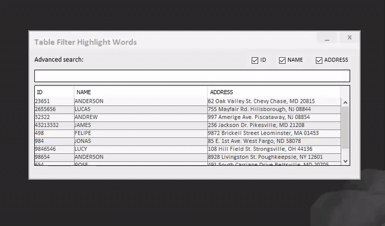

# Java (Swing) Table Filter With Highlight Words
Example of filter on tables with some advanced options for study, "streams" were not used because I am not yet used to using them, whoever is willing to contribute with the code will be well received: D

***GIF from the example below:***

